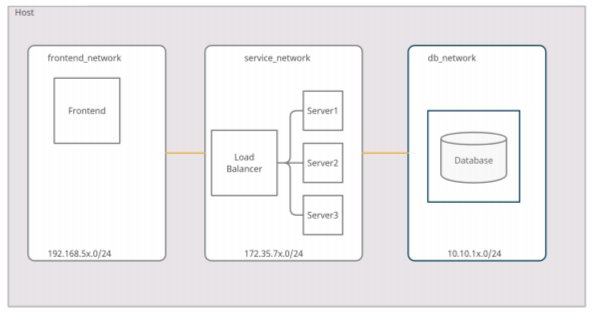

# Practica 4

#### Arquitectura




| Servicio         | IP              |
| ---------------- | --------------- |
| frontend_network | 192.168.51.0/24 |
| service_network  | 172.35.71.0/24  |
| db_network       | 10.10.11.0/24   |


#### Flujo:

se dockerizaron los diferentes servicios, en el service_network se hizo uso de un nginx como balanceador de carga para distribuir la carga en 3 nodos, el frontend_network y el db_network tambien se dockerizaron. Se hizo uso de docker-compose para implementar la arquitectura. 


##### Servicios (.yaml y dockerfile utilizados):

###### service_network:

```yaml
    nginx:
        image: nginx:1.15
        container_name: nginx
        volumes:
            - ./default.conf:/etc/nginx/conf.d/default.conf
        ports:
            - 80:80
        networks: 
            service_network:
                ipv4_address: 172.35.71.2
        depends_on:
            - backend1
            - backend2
            - backend3

    backend1:
        build: backend/.
        container_name: backend1
        ports: 
            - '5001:5000'
        volumes:
            - '.:/backend/code'
        environment: 
            - SERVNAME=201612272
        networks: 
            service_network:
                ipv4_address: 172.35.71.3
    
    backend2:
        build: backend/.
        container_name: backend2
        ports: 
            - '5002:5000'
        volumes:
            - '.:/backend/code'
        environment: 
            - SERVNAME=201612345
        networks: 
            service_network:
                ipv4_address: 172.35.71.4

    backend3:
        build: backend/.
        container_name: backend3
        ports: 
            - '5003:5000'
        volumes:
            - '.:/backend/code'
        environment: 
            - SERVNAME=201654321
        networks: 
            service_network:
                ipv4_address: 172.35.71.5

```


Dockerfile

```dockerfile
FROM python:3.8
ADD . /code
WORKDIR /code
RUN pip install -r requirements.txt
CMD python app.py
```


###### db_network

```yaml
    database:
        image: mysql:latest
        container_name: bases-db
        ports: 
            - '3306:3306'
        environment: 
            MYSQL_ROOT_PASSWORD: 12345678
            MYSQL_DATABASE: P4Redes
            MYSQL_USER: admin
            MYSQL_PASSWORD: admin
        volumes:
            - database:/var/lib/mysql
        networks: 
            db_network:
                ipv4_address: 10.10.11.2
```


###### redes utilizadas:

```yaml
networks:
    # frontend_network:
    #     driver: bridge
    #     ipam:
    #         driver: default
    #         config:
    #         - subnet: "192.168.51.0/24"

    service_network:
        driver: bridge
        ipam:
            driver: default
            config:
                - subnet: "172.35.71.0/24"

    db_network:
        driver: bridge
        ipam:
            driver: default
            config:
                - subnet: "10.10.11.0/24"
```


###### volumen 

```yaml
volumes:
    database:
```


###### Configuración de nginx:

```yacas
upstream flask-app {
    server 172.35.71.3:5000;
    server 172.35.71.4:5000;
    server 172.35.71.5:5000;
}

server {
    listen 80;
    server_name localhost;

    location / {
        proxy_pass http://flask-app;
        proxy_set_header Host "localhost";
        proxy_set_header X-Forwarded-For $proxy_add_x_forwarded_for;
        proxy_redirect off;
    }
}
```

